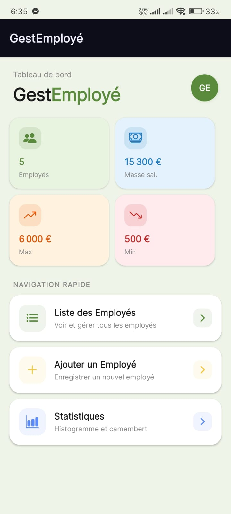
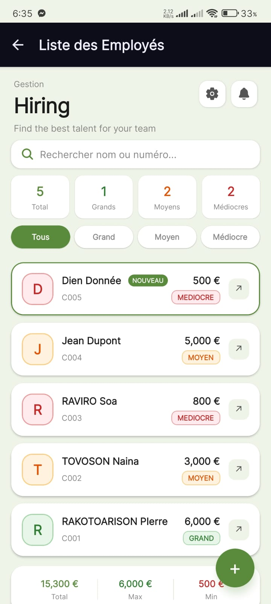
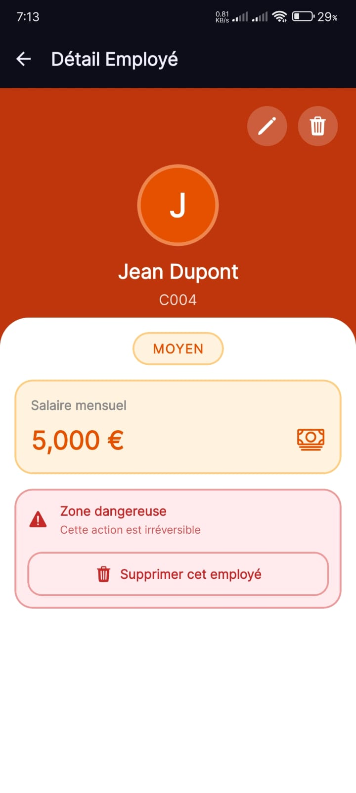
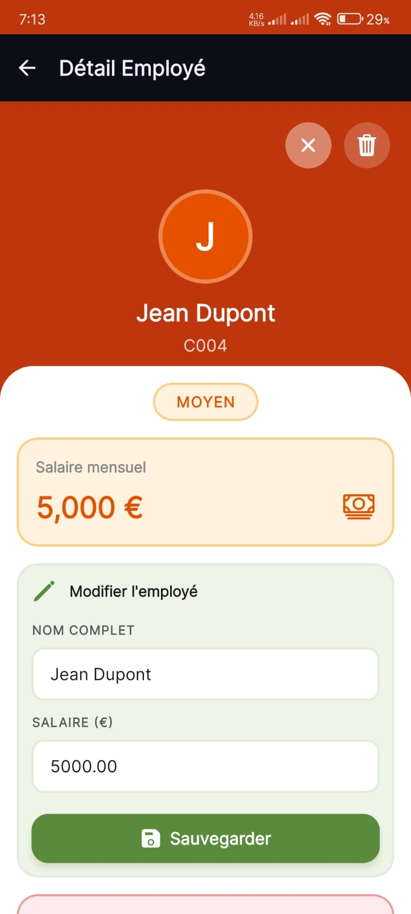
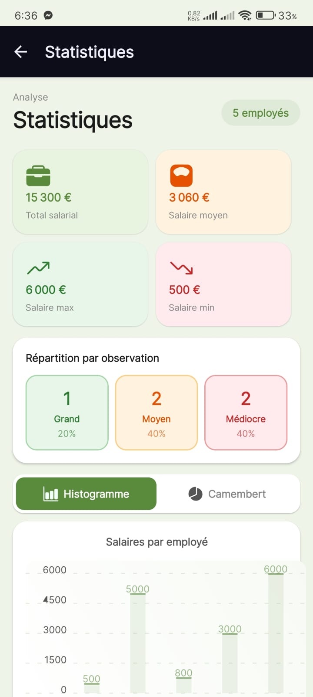
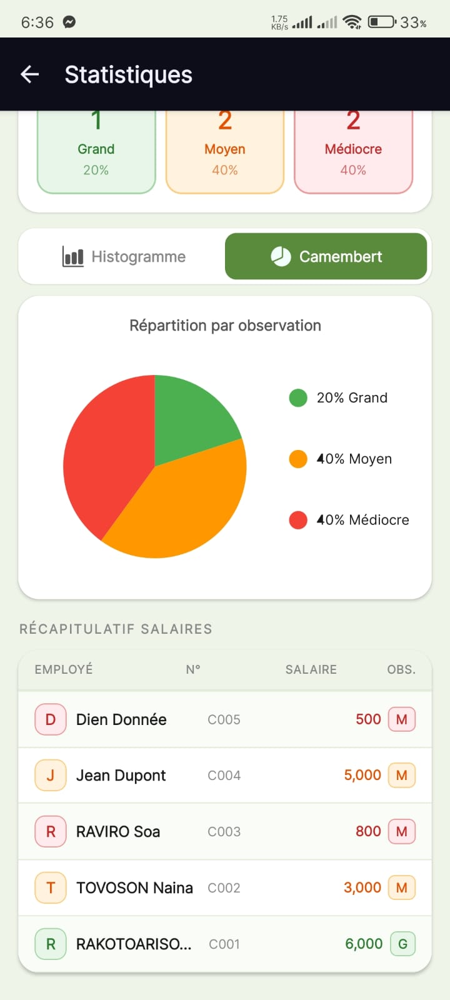

# GestEmploye

Application mobile de gestion des employés développée avec **Expo / React Native**.

## Description

GestEmploye permet de :

- consulter la liste des employés,
- ajouter un nouvel employé,
- consulter les détails d'un employé,
- modifier le nom et le salaire,
- supprimer un employé,
- visualiser des statistiques avec histogramme et camembert.

## Stack technique

- **Expo SDK 54**
- **React Native 0.81.5**
- **React Navigation** (`@react-navigation/native`, `@react-navigation/stack`, `@react-navigation/bottom-tabs`)
- **Expo Router**
- **Axios** pour les appels API
- **react-native-chart-kit** pour les graphiques
- **@expo/vector-icons** et **react-native-vector-icons** pour les icônes
- **react-native-safe-area-context** pour les zones de sécurité
- **expo-splash-screen** pour le splash screen

## Structure du projet

```text
GestionEmployeV2.0/
+-- App.js
+-- app.json
+-- assets/
    +-- splash.png
    +-- screenshots/  # captures d'écran à ajouter si besoin
+-- package.json
+-- scripts/
    +-- reset-project.js
+-- src/
    +-- api/
        +-- api.js
    +-- components/
        +-- EmployeCard.js
    +-- screens/
        +-- AjouterScreen.js
        +-- DetailScreen.js
        +-- HomeScreen.js
        +-- ListeScreen.js
        +-- StatsScreen.js
```

### Fichiers clés

- `App.js` : point d'entrée de l'application.
- `app.json` : configuration Expo (splash, icône, plateformes).
- `package.json` : scripts et dépendances.
- `src/api/api.js` : gestion des appels API pour les employés.
- `src/screens/` : écrans principaux de l'app.

## Installation

Cloner le dépôt :

```bash
git clone https://github.com/sanzouh/GestEmploye.git
cd GestEmploye
```

Installer les dépendances :

```bash
npm install
```

## Lancer l'application

Démarrer Expo :

```bash
npm start
```

Ouvrir sur une plateforme :

```bash
npm run android
npm run ios
npm run web
```

## Commandes utiles

- `npm start` : démarre le serveur Expo.
- `npm run android` : ouvre l'app sur Android.
- `npm run ios` : ouvre l'app sur iOS.
- `npm run web` : lance la version web.
- `npm run lint` : analyse le code avec ESLint.

## Remote Git

Remote par défaut :

- `origin` <https://github.com/sanzouh/GestEmploye.git>

## Captures d'écran

<p>
  
  
  
  
  
  
</p>

## Bonnes pratiques pour reprendre le projet

- Commencez par lire les écrans dans `src/screens/` pour comprendre le flux.
- `src/api/api.js` gère la communication avec le backend.
- Les styles sont définis localement dans chaque écran pour faciliter l'itération.
- Ajoutez des captures d'écran aux emplacements indiqués pour enrichir la documentation.

## Notes

Ce projet est conçu pour être facile à reprendre et à étendre : interface réactive, navigation simple, gestion de données via API et statistiques interactives.
